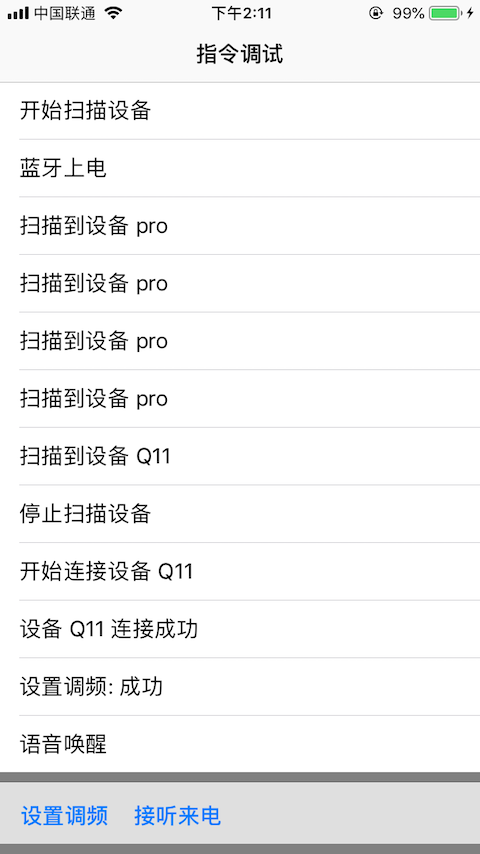

# VIBLEManager

远御车载语音支架的蓝牙通信模块，负责蓝牙设备的扫描、配对、指令下发

## 安装

VIBLEManager 是一个独立的模块，依赖于 CoreBluetooth，可以通过 [CocoaPods](https://cocoapods.org) 来安装，
只需要在 Podfile 中增加如下代码

```ruby
pod 'VIBLEManager', :git => 'https://github.com/guofengld/VIBLEManager.git'
```

或者下载 [源代码](https://github.com/guofengld/VIBLEManager/tree/master/VIBLEManager)，手动添加
到工程中便可，别忘了在工程文件中 link CoreBluetooth.framework

## 示例
clone 整个 repo，并且安装相关依赖 

```bash
git clone git@github.com:viroyalnj/VIBLEManager.git

cd VIBLEManager/Example/
pod install
```

安装完成之后，启动工程 

```bash
open VIBLEManager.xcworkspace/
```

此 Demo 可以在真机上运行，搭配远御支架设备，可以获得以下界面效果



对应地，有如下日志输出

```
BLE name: Q11 advertisementData: {
    kCBAdvDataIsConnectable = 1;
    kCBAdvDataLocalName = Q11;
    kCBAdvDataServiceUUIDs =     (
        FF10
    );
}

BLE didConnectPeripheral: Q11
BLE didDiscoverServices: FF10
BLE didDiscoverCharacteristic: FFF1
BLE << AT+FMFREQ=933
BLE >> +FMFREQ:933
BLE >> OK
```


## 使用

### 初始化

```objective-c
BLEManager *manager = [BLEManager manager];
manager.delegate = self;
```

### BLEManagerDelegate 实现

```objective-c
// 蓝牙硬件状态改变通知
- (void)bleManager:(BLEManager *)manager stateDidChange:(CBManagerState)state;

// 扫描状态改变通知
- (void)bleManager:(BLEManager *)manager scaningDidChange:(BOOL)scaning;

// 是否配对扫描到的这个设备
- (BOOL)bleManager:(BLEManager *)manager shouldPairDeviceWithName:(NSString *)name;

// 设备配对成功
- (void)bleManager:(BLEManager *)manager devicePaired:(NSString *)name;

// 蓝牙扫描失败
- (void)bleManagerDeviceSearchDidFailed:(BLEManager *)manager;

// 蓝牙设备断开连接
- (void)bleManager:(BLEManager *)manager deviceDidDisconnected:(NSString *)name;
```

### 指令下发

```objective-c
/*
 * 向蓝牙设备发送指令，所有的指令会按照先后顺序，逐条发送，指令处理完成后，会调用 completion
 @param string 指令内容，非空
 @completion 完成回调
 */
- (void)sendCommand:(NSString *)string
     withCompletion:(nullable CommonBlock)completion;

/*
 * 便捷设置电台频率
 */

- (void)setRadioFrequency:(CGFloat)frequency
           withCompletion:(nullable CommonBlock)completion;

```
## AT 指令集
### 说明
本节描述蓝牙设备（Q11）与御驾助手 app 基于蓝牙BLE协议的通信机制。<br/>
Q11作为GATT server端，通过特定的SERVICE UUID: ```0000ff10-0000-1000-8000-00805f9b34fb```获取service，通过Characteristic UUID: ```0000fff1-0000-1000-8000-00805f9b34fb``` 进行数据读写以及notify 操作。
### 指令
按照标准AT指令制定，回复是Q11接收到APP指令后发送给APP的返回值或者APP发送给Q11的返回值，确认通信正常。 

* 识别语音设备 <br/>
设备开机会有两种蓝牙设备，一种是 **BLE** 设备，通过特定的SERVICE UUID和名称Q11进行连接，一种是蓝牙耳机设备，名称 **Q11**，正常连接即可。

* FM发射 <br/>
指令：```AT+FMFREQ=设置频率``` <br/>
描述：app 下发给Q11设置FM发射频率的指令。设置的频率=实际频率X10，例如 ```AT+FMFREQ=1016```，实际频率是101.6。<br/>
回复: ```+FMFREQ：101.6\r\nOK\r\n```

* 接听电话 
指令：```AT+CALLANSW```<br/>
描述：APP下发给Q11用于接听电话。<br/>
回复：```+CALLANSW\r\nOK\r\n```

* 挂断电话 <br/>
指令：```AT+CALLEND``` <br/>
描述：APP下发用于挂断当前通话。<br/>
回复: ```+CALLEND\r\nOK\r\n```

* 唤醒 <br/>
指令：```AT+WAKEUP```<br/>
描述：Q11的PSERSOR唤醒后，上报给APP的指令，提示Q11已唤醒。<br/>
回复：```+WAKEUP\r\nOK\r\n```

## 贡献

如果有新的需求，请提交 [issue](https://github.com/guofengld/VIBLEManager/issues)

欢迎 [pr](https://github.com/guofengld/VIBLEManager/pulls)

## License

[MIT](./LICENSE)

